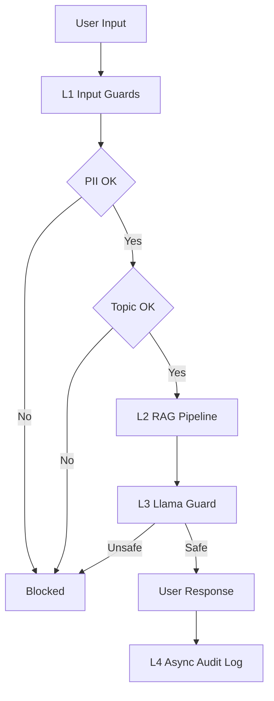

# Production Blueprint

## SLO Definitions

| Metric | Target | Alert Threshold | Severity |
|---|---|---|---|
| Faithfulness | >= 0.85 | < 0.80 | P2 |
| Answer Relevancy | >= 0.80 | < 0.75 | P2 |
| Context Precision | >= 0.70 | < 0.65 | P3 |
| Context Recall | >= 0.75 | < 0.70 | P3 |
| P95 Latency | < 2.5s | > 3s | P1 |

---

## Architecture Diagram

---

## Alert Playbook

### Incident — Faithfulness Drop

Severity: P2

Likely causes:

1. Retrieval failure
2. Prompt drift
3. Index corruption

Investigation:

1. Check retriever logs
2. Compare prompt versions
3. Rebuild embeddings

Resolution:

- re-index corpus
- rollback prompts
- tune retriever parameters

---

## Cost Analysis

| Component | Monthly Cost |
|---|---|
| RAG Generation | $100 |
| RAGAS Eval | $10 |
| LLM Judge | $50 |
| Guardrails | $216 |
| Total | $376 |